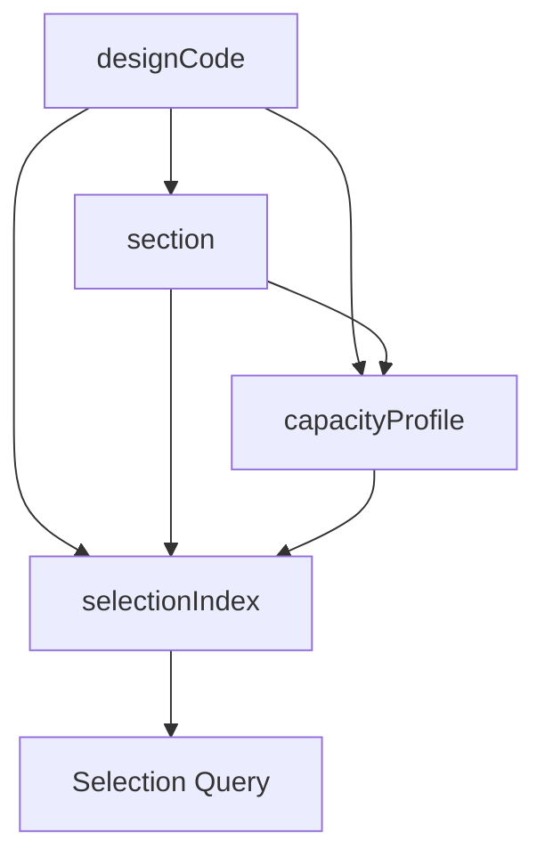
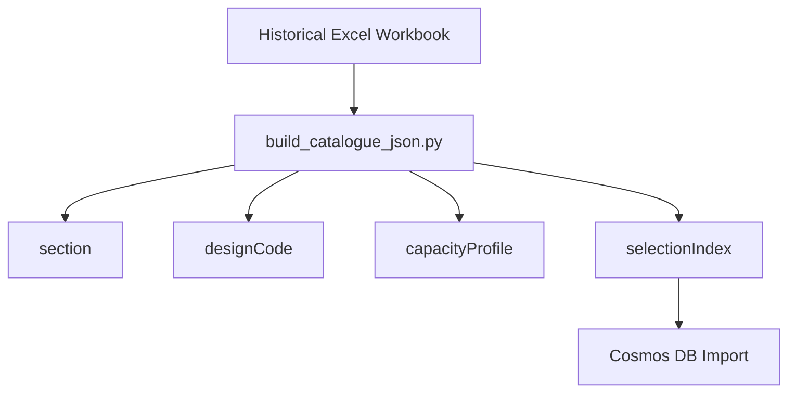

# Section Catalogue Cosmos DB Data Model

This repository converts historical structural steel section catalogues into structured Cosmos DB JSON datasets for engineering search, traceability, and AI-assisted structural inference.

The generated data is designed for:

* historical section identification
* section suitability search
* engineering traceability
* design-code-aware capacity lookup
* downstream AI and rules-engine workflows
* efficient Azure Cosmos DB querying at scale

The catalogue spans multiple historical periods and rolling standards, including:

* Dorman Long rolled sections
* British Standard 4 sections
* historical handbook references
* London County Council legislation
* Redpath Brown guidance
* Institution of Structural Engineers guidance
* British Standards 449 eras

---


# Cosmos DB architecture

## Database

```text
section-catalogue-cosmos-db
```

## Containers

```text
sectionCatalogue
designCodes
```

---

# Container: `sectionCatalogue`

This is the primary engineering/query container.

It stores:

* `section`
* `capacityProfile`
* `selectionIndex`

documents together.

## Hierarchical partition key (HPK)

```text
/designCodeId, /sectionKey
```

This ensures all related documents for:

```text
(designCodeId + sectionKey)
```

are colocated physically inside Cosmos.

Example logical partition:

```text
designCodeId = lcc-1909
sectionKey   = NBSB 18
```

Contains:

```text
section
capacityProfile
selectionIndex
```

for that exact engineering context.

---

# Container: `designCodes`

Stores design-code metadata separately.

## Partition key

```text
/designCodeId
```

This is a small reference dataset.

---

# Document model overview

| Document Type     | Container          | Purpose                                                      |
| ----------------- | ------------------ | ------------------------------------------------------------ |
| `section`         | `sectionCatalogue` | Defines the section identity within a design-code context    |
| `capacityProfile` | `sectionCatalogue` | Stores engineering capacities and curves                     |
| `selectionIndex`  | `sectionCatalogue` | Flattened query-optimised engineering selection document     |
| `designCode`      | `designCodes`      | Defines the design basis, handbook, legislation, or standard |

---

# Cosmos document conventions

## IDs

All documents use:

```json
"id": "uuid"
```

UUIDs are generated during ETL.

## Slugs

Every document also contains a deterministic slug:

```json
"slug": "capacity-profile__lcc-1909__NBSB-18__beam__1921-1932"
```

The slug acts as:

* a deterministic identifier
* a regeneration-safe key
* a debugging aid
* a human-readable reference
* a cross-document linkage mechanism

The slug is the stable engineering identifier.

The Cosmos `id` is only the physical database identity.

---

# Data relationships



---

# Document type: `section`

A section document defines a catalogue section identity inside a design-code partition.

Example:

```json
{
  "docType": "section",
  "id": "c6f5fd1b-09fd-4d39-bc0c-cd73fa779f8e",
  "slug": "section__lcc-1909__NBSB-18__1921-1932",
  "designCodeId": "lcc-1909",
  "sectionKey": "NBSB 18",
  "sectionSlug": "NBSB-18",
  "memberTypes": [
    "beam",
    "column"
  ],
  "applicability": {
    "periodStartYear": 1921,
    "periodEndYear": 1932
  }
}
```

## Notes

Sections are intentionally duplicated per:

```text
designCodeId + catalogue period
```

This is deliberate to support HPK locality.

---

# Document type: `designCode`

Defines the engineering/design basis.

Example:

```json
{
  "docType": "designCode",
  "id": "6bb8e3d7-c91e-4f8a-9f88-8cc44f2f9dc0",
  "slug": "lcc-1909",
  "designCodeId": "lcc-1909",
  "label": "London County Council (General Powers) Act 1909",
  "applicability": {
    "periodStartYear": 1909,
    "periodEndYear": 1948
  },
  "sourceType": "legislation"
}
```

---

# Document type: `capacityProfile`

Stores engineering capacities for one section under one design code.

Supports both:

* beam capacities
* column capacity curves

---

## Beam capacity profile example

```json
{
  "docType": "capacityProfile",
  "id": "f8bdb99d-b8e2-4f9e-b26d-0fbb0a6db42a",
  "slug": "capacity-profile__lcc-1909__NBSB-18__beam__1921-1932",
  "designCodeId": "lcc-1909",
  "sectionKey": "NBSB 18",
  "memberType": "beam",
  "capacities": {
    "bendingMomentTension": {
      "value": 1527.0,
      "unit": "tons-in"
    },
    "shearForce": {
      "value": 145.6,
      "unit": "tons"
    }
  },
  "normalised": {
    "bendingMomentTensionKnM": 386.46,
    "shearForceKn": 1450.64
  }
}
```

---

## Column capacity profile example

```json
{
  "docType": "capacityProfile",
  "id": "ac7b0d3b-14a9-48bc-9af5-1d7fd6d25d40",
  "slug": "capacity-profile__lcc-1909__NBSB-18__column__1921-1932",
  "designCodeId": "lcc-1909",
  "sectionKey": "NBSB 18",
  "memberType": "column",
  "capacityCurve": {
    "type": "allowableAxialCompressionByHeight",
    "heightUnit": "m",
    "unit": "tons",
    "points": [
      {
        "heightM": 1.0,
        "value": 43.3,
        "allowableAxialCompressionKn": 431.44
      },
      {
        "heightM": 14.0,
        "value": null,
        "allowableAxialCompressionKn": null,
        "isValid": false
      }
    ]
  }
}
```

---

# Historical NIL handling

Historical column tables frequently contain:

```text
NIL
```

These are intentionally preserved as:

```json
{
  "value": null,
  "allowableAxialCompressionKn": null,
  "isValid": false
}
```

This preserves historical engineering meaning:

```text
no allowable capacity exists
```

rather than incorrectly implying:

```text
unknown value
```

---

# Document type: `selectionIndex`

The primary query document.

This is intentionally flattened and denormalised for Cosmos query efficiency.

Example:

```json
{
  "docType": "selectionIndex",
  "id": "d82b7d6d-5d67-48d0-83cb-cba1d2db5b6f",
  "slug": "selection-index__lcc-1909__NBSB-18__beam__1921-1932",
  "designCodeId": "lcc-1909",
  "sectionKey": "NBSB 18",
  "memberType": "beam",
  "normalisedCapacity": {
    "bendingMomentTensionKnM": 386.46,
    "shearForceKn": 1450.64
  },
  "selection": {
    "isSelectable": true,
    "confidence": "high"
  },
  "sourceProfileSlug": "capacity-profile__lcc-1909__NBSB-18__beam__1921-1932"
}
```

---

# Supported catalogue periods

The ETL process supports multiple historical catalogue ranges simultaneously.

Examples:

```text
1887-1903
1903-1921
1921-1932
```

Slugs include catalogue periods to prevent collisions between eras.

Example:

```text
capacity-profile__lcc-1909__NBSB-18__beam__1903-1921
capacity-profile__lcc-1909__NBSB-18__beam__1921-1932
```

---

# Unit normalisation

The ETL preserves:

* original imperial values
* original source units
* normalised metric values

Current conversions include:

| Source Unit | Normalised Unit |
| ----------- | --------------- |
| `tons-in`   | `kNm`           |
| `tons`      | `kN`            |

Configuration is controlled via:

```text
config/units.json
```

---

# Spot checking and validation

Validation script:

```bash
python scripts/spot_check_catalogue_output.py
```

Checks include:

* UUID validity
* duplicate IDs
* duplicate slugs
* partition-key completeness
* design-code references
* profile references
* beam normalisation structure
* column curve integrity
* NIL preservation
* filename/slug consistency
* empty output folders

---

# ETL generation workflow



---

# Example dataset generation commands

## Clear existing output

```bash
rm -rf data/output

mkdir -p \
  data/output/sections \
  data/output/designCodes \
  data/output/capacityProfiles \
  data/output/selectionIndex
```

---

## 1887-1903

### Beams

```bash
python scripts/build_catalogue_json.py \
  --input "data/raw/1887-1903-beams.xlsx" \
  --member-type beam
```

### Columns

```bash
python scripts/build_catalogue_json.py \
  --input "data/raw/1887-1903-columns.xlsx" \
  --member-type column
```

---

## 1903-1921

### Beams

```bash
python scripts/build_catalogue_json.py \
  --input "data/raw/1903-1921-beams.xlsx" \
  --member-type beam
```

### Columns

```bash
python scripts/build_catalogue_json.py \
  --input "data/raw/1903-1921-columns.xlsx" \
  --member-type column
```

---

## 1921-1932

### Beams

```bash
python scripts/build_catalogue_json.py \
  --input "data/raw/1921-1932-beams.xlsx" \
  --member-type beam
```

### Columns

```bash
python scripts/build_catalogue_json.py \
  --input "data/raw/1921-1932-columns.xlsx" \
  --member-type column
```

---